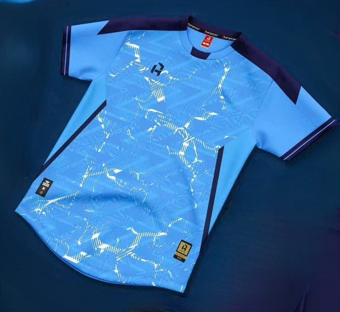

<html lang="vi">
<head>
    <meta charset="UTF-8">
    <meta name="viewport" content="width=device-width, initial-scale=1.0">
    <title>T4-FC | THPT Nguyễn Văn Hai</title>
    
</head>
<body>
    <header>
        
        <h1>T4-FC | THPT Nguyễn Văn Hai</h1>
    </header>
    <!-- Thanh mục lục (Menu điều hướng) -->
<nav class="navbar">
  <ul>
    <li><a href="#gioithieu">Giới thiệu</a></li>
    <li><a href="#aodau">Áo đấu</a></li>
    <li><a href="#cauthu">Danh sách cầu thủ</a></li>
    <li><a href="#lienhe">Liên hệ</a></li>
    <li><a href="#san">Sân thi đấu</a></li>  
  </ul>
</nav>

    <section id="gioithieu">
        <h2>🔥 T4-FC – Tinh thần thể thao của THPT Nguyễn Văn Hai! 🔥</h2>
        

            Thành lập ngày <strong>24/10/2024</strong>, <strong>T4-FC</strong> không chỉ là một đội bóng, mà còn là biểu tượng của tinh thần đoàn kết, khát khao chinh phục và đam mê sân cỏ.
            Dưới sự dẫn dắt của <strong>Huấn luyện viên Trần Văn Anh Khoa</strong>, các cầu thủ trẻ đã không ngừng rèn luyện, chiến đấu với trái tim rực lửa và niềm tin chiến thắng.
        

        

            Trên sân <strong>SÂN BÓNG - KHU LIÊN HỢP THỂ THAO CHÍ HÙNG</strong>, nơi mà chúng tôi gọi là “ngôi nhà thứ hai”, tiếng hô vang <strong>“THE FOURCE!”</strong> luôn là nguồn động lực mạnh mẽ, kết nối tất cả thành một tập thể bất khả chiến bại.
        

        
<strong>💪 T4-FC – Chiến đấu hết mình, vì danh dự, vì đam mê, vì tinh thần Nguyễn Văn Hai bất diệt!</strong>

    </section>
    <section>
  <h2>🏆 Lịch sử hình thành và phát triển</h2>
  

    Vào những ngày đầu của năm lớp 10(23-24), trên sân <strong>Học Đường</strong> chỉ có vài học sinh yêu bóng đá thường xuyên tụ tập để cùng nhau đá vui sau giờ học. 
    Trong số đó, một vài người đã từng được thi đấu ở các cấp dưới, có kinh nghiệm và niềm đam mê mãnh liệt với trái bóng tròn. 
    Chính từ những buổi tập đầy tiếng cười và tinh thần đồng đội ấy, ý tưởng thành lập một đội bóng chính thức của lớp dần được nhen nhóm.
  

  

    Cuối năm lớp 10(23-24), khi sự gắn kết giữa các thành viên ngày càng mạnh mẽ hơn, ý tưởng ấy được hiện thực hóa. 
    Đến đầu năm lớp 11, khoảng cuối tháng 9, số lượng thành viên tham gia các buổi đá bóng đã vượt con số 10. 
    Sau nhiều cuộc trò chuyện, chia sẻ và rủ rê, vào ngày <strong>24/10/2024</strong>, nhóm Zalo <strong>T4-FC</strong> chính thức được thành lập với 17 thành viên — đánh dấu cột mốc ra đời của đội bóng mang tinh thần trẻ trung, đoàn kết và khát vọng cháy bỏng.
  

  

    Dưới sự dẫn dắt của <strong>Coach-Trần Văn Anh Khoa</strong>, T4-FC bước vào những ngày đầu hoạt động đầy hứng khởi. 
    Tuy sở hữu lợi thế về số lượng nhưng đội vẫn còn non kinh nghiệm, lối chơi chưa đồng đều. 
    Trận đấu chính thức đầu tiên — cuộc đối đầu với A3 — tuy kết thúc bằng một thất bại, nhưng đó cũng chính là “bước ngoặt vàng”, mở ra hành trình rèn luyện, trưởng thành và hoàn thiện của từng thành viên. 
    Ngày hôm ấy không chỉ là đá giao hữu, mà còn là trận đấu ra mắt <strong>bộ áo đấu đầu tiên</strong> – biểu tượng cho tinh thần và niềm tự hào của T4-FC.
  

  

    Trong suốt năm lớp 11(24-25), đội không ngừng tập luyện và thi đấu. 
    Dù là giữa trưa nắng gắt, khi mưa rơi nặng hạt, hay lúc bóng tối dần phủ kín sân, <strong>T4-FC</strong> vẫn luôn hiện diện – mồ hôi thấm áo, ý chí không bao giờ tắt. 
    Từ những thất bại đầu tiên, đội đã xây dựng nên bản sắc riêng: thi đấu có chiến thuật, phối hợp nhuần nhuyễn, và trên hết là tinh thần “chiến đấu vì nhau”.
  

  

    Thành quả của những tháng ngày khổ luyện chính là việc <strong>T4-FC</strong> dần đánh bại những đối thủ mạnh trong trường, khẳng định vị thế của mình như một đội bóng đáng gờm. 
    Dù hiện tại, khi đã bước vào năm cuối cấp, áp lực học tập ngày một lớn, phong độ đôi lúc sa sút – nhưng ngọn lửa đam mê sân cỏ trong tim từng thành viên vẫn luôn cháy rực. 
    T4-FC không chỉ là một đội bóng, mà còn là một gia đình, nơi tình bạn, nhiệt huyết và khát vọng chiến thắng luôn song hành cùng năm tháng học trò.
  

</section>

    <section id="aodau">
        <h2>👕 Áo thi đấu chính thức của T4-FC</h2>
        

            

                
                
Áo thi đấu

            

            

                
                
Áo thi đấu

            

        

<section id="cauthu">
        <h2 style="margin-top: 40px;">👥 Danh sách cầu thủ</h2>
    <table>
    <tr>
        <th>STT</th>
        <th>Tên cầu thủ</th>
        <th>Số áo</th>
        <th>Vị trí</th>
        <th>Ghi chú</th>
    </tr>
    <tr><td>1</td><td onclick="showPlayerInfo('Anh Oblak')" style="cursor:pointer; color:#007bff;">Anh Oblak</td><td>1</td><td>GK</td><td>Thủ thành thép giữ vững niềm tin nơi khung gỗ</td></tr>
    <tr><td>2</td><td onclick="showPlayerInfo('Daniel Bảo')" style="cursor:pointer; color:#007bff;">Daniel Bảo</td><td>2</td><td>LB</td><td>Bức tường cánh trái, cản phá hàng công</td></tr>
    <tr><td>3</td><td onclick="showPlayerInfo('Thịnh Mbappe')" style="cursor:pointer; color:#007bff;">Thịnh Mbappe</td><td>4</td><td>RW</td><td>Tốc độ như tên bắn, những pha bức tốc khó tin</td></tr>
    <tr><td>4</td><td onclick="showPlayerInfo('Ngọc Tài')" style="cursor:pointer; color:#007bff;">Ngọc Tài</td><td>7</td><td>ST</td><td>Sát thủ vòng cấm, xuất hiện đúng lúc săn bàn chủ lực</td></tr>
    <tr><td>5</td><td onclick="showPlayerInfo('Triều Liều')" style="cursor:pointer; color:#007bff;">Triều Liều</td><td>8</td><td>CDM</td><td>Lá chắn vững chắc, chiến đấu không biết mệt mỏi</td></tr>
    <tr><td>6</td><td onclick="showPlayerInfo('Hào Milk')" style="cursor:pointer; color:#007bff;">Hào Milk</td><td>9</td><td>LW</td><td>Kỹ thuật tinh tế, át chủ bài trên hàng công</td></tr>
    <tr><td>7</td><td onclick="showPlayerInfo('Qui Musiala')" style="cursor:pointer; color:#007bff;">Qui Musiala</td><td>10</td><td>CAM</td><td>Khéo léo, sáng tạo và có tư duy chiến thuật</td></tr>
    <tr><td>8</td><td onclick="showPlayerInfo('Hiền Gullit')" style="cursor:pointer; color:#007bff;">Hiền Gullit</td><td>11</td><td>CF</td><td>Cân bằng tuyến giữa tạo đột phá trong mọi tình huống</td></tr>
    <tr><td>9</td><td onclick="showPlayerInfo('Toàn Rivaldo')" style="cursor:pointer; color:#007bff;">Toàn Rivaldo</td><td>17</td><td>LW</td><td>Tốc độ biết cách đột biến ở những pha tấn công</td></tr>
    <tr><td>10</td><td onclick="showPlayerInfo('Khoa Kroos')" style="cursor:pointer; color:#007bff;">Khoa Kroos</td><td>18</td><td>CM</td><td>Chuyên gia chuyền dài, lên công, về thủ nhịp nhàng</td></tr>
    <tr><td>11</td><td onclick="showPlayerInfo('Lamine GiaHuy')" style="cursor:pointer; color:#007bff;">Lamine GiaHuy</td><td>19</td><td>RW</td><td>Khả năng bứt tốc và tạt bóng chuẩn xác</td></tr>
    <tr><td>12</td><td onclick="showPlayerInfo('Quí Gea')" style="cursor:pointer; color:#007bff;">Quí Gea</td><td>20</td><td>GK</td><td>Phòng thủ chắc chắn, tập trung sẵn sàng cứu thua</td></tr>
    <tr><td>13</td><td onclick="showPlayerInfo('Nhân Pirlo')" style="cursor:pointer; color:#007bff;">Nhân Pirlo</td><td>21</td><td>CM</td><td>Kiểm soát trận đấu bằng những đường chuyền đẳng cấp</td></tr>
    <tr><td>14</td><td onclick="showPlayerInfo('Trường Tân')" style="cursor:pointer; color:#007bff;">Trường Tân</td><td>22</td><td>RW</td><td>Mũi khoan cánh phải ghi bàn chuẩn xác</td></tr>
    <tr><td>15</td><td onclick="showPlayerInfo('Phong Kumalala')" style="cursor:pointer; color:#007bff;">Phong Kumalala</td><td>24</td><td>LW</td><td>Cơn lốc cánh trái kỹ thuật và tốc độ bùng nổ</td></tr>
   <tr><td>16</td><td onclick="showPlayerInfo('Kha Boiz')" style="cursor:pointer; color:#007bff;">Kha Boiz</td><td>28</td><td>CDM</td><td>Đa năng, luôn biết cách tạo sự khác biệt</td></tr>
   <tr><td>17</td><td onclick="showPlayerInfo('Kha Kaka')" style="cursor:pointer; color:#007bff;">Kha Kaka</td><td>29</td><td>CAM</td><td>Bậc thầy kiến tạo linh hồn sáng tạo nơi tuyến giữa</td></tr>
</table>

    </section>
    <section id="lienhe">
  <h2 class="contact-title">📩 Liên hệ</h2>
  

    Nếu các đội bóng khác muốn <strong>giao lưu, tổ chức trận đấu hữu nghị</strong> hoặc 
    <strong>liên hệ hợp tác</strong> cùng T4-FC, hãy gửi thông tin cho chúng tôi tại đây:
  

  <form id="contactForm" action="https://formspree.io/f/mkgwojqy" method="POST"
        class="contact-form">
    
    <label for="name" class="label"><strong>Tên đội bóng hoặc người liên hệ</strong></label> 
    <input type="text" id="name" name="name" required class="input"> 

    <label for="email" class="label"><strong>Email hoặc số điện thoại</strong></label> 
    <input type="text" id="email" name="email" required class="input"> 

    <label for="message" class="label"><strong>Nội dung liên hệ</strong></label> 
    <textarea id="message" name="message" rows="4" required class="textarea"></textarea> 

    <button type="submit" id="submitBtn" class="btn">
      Gửi liên hệ
    </button>

    

  </form>
</section>

<section id="san">
  <h2>📍 Sân thi đấu </h2>
  
Địa chỉ: <strong>W6FJ+M2H, Huyền Hội, Càng Long, Trà Vinh, Việt Nam</strong>

  <a href="https://www.google.com/maps/place/W6FJ%2BM2H,+Huy%E1%BB%81n+H%E1%BB%99i,+C%C3%A0ng+Long,+Tr%C3%A0+Vinh,+Vi%E1%BB%87t+Nam" 
     target="_blank" 
     class="map-btn">
     🔗 Xem vị trí trên Google Maps
  </a>
</section>

    <footer>
        
© 2025 T4-FC | THPT Nguyễn Văn Hai — Khẩu hiệu: <strong>THE FOURCE</strong>

    </footer>
<!-- Popup hiển thị thông tin cầu thủ -->

  

    &times;

    

      <h2 id="playerName"></h2>
      
<strong>Năm sinh:</strong> 

      
<strong>Nơi sinh:</strong> 

      
<strong>Chiều cao:</strong> 

      
<strong>Cân nặng:</strong> 

      
<strong>Vị trí:</strong> 

      <a id="playerFb" href="#" target="_blank" class="fb-link">Facebook</a>
    

    

      
    

  

